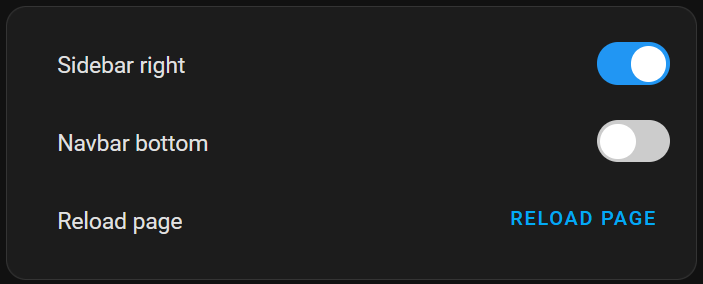

# Mobile UI

## Motivation
Easier One Hand Navigation for Home Assistant

## Features
* Move the sidebar to the right
* Move the navbar to the bottom

## Installation

### HACS

1. Add this repository to HACS
2. Install the "Mobile UI" card

### Manual

1. Download the `ha-mobile-ui.js` file from the repo and place it in your `www` folder of home assistant.
2. Add the following to your `ui-lovelace.yaml` file:

